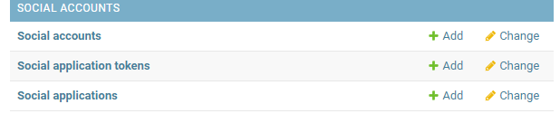

# django_project


# 파이참으로 실행시 가이드  


## 파이참이 작업하기 훨씬 편하다 .gitigonre 만들고 사항 적용해줄것


### 실습 따라하기 
- 1. 파이참 인터프리터 가상환경 설정하기 
- 2. pip 장고
- 3. project 시작 app만들기 
- 4. 모델 만들기  
- 5. makemigrations, migrate 하고 나서 깃 올리고 gitignore에 migrations/ 추가 
- 6. 자신의 모델 가상환경 .gitnore에 올려놓고 사용할것 


### class view에서 주의사항
- ListView는 기본적으로 모델명_list가 붙은 파일을 템플릿으로 사용함
- Updateview, CreateView는 모델명_form.html을 자동으 사용 
- Detailview는 모델명_detail.html을 사용한다
- 이러한 구조가 마음에 들지 않을때는 
- template_name = '템플릿주소.html'으로 고정가능

## CreateView 템플릿 관련
'''
<form method="post" enctype="multipart/form-data">
  

  <table>
    {{form}}
  </table>
  <button type="submit" class="btn btn-primary float-right">Submit</button>
</form>

'''
-post 로 보내주고 파일 전송시에는 enctype 넣어주고
- csrf_token을 필수로 넣어줄것!
- form 안에는 본인이 view에서 지정한 필드들이 들어갑니다.

### 모델 관계에서의 받아오는법 
- x 모델이 있고 y모델에서 x모델을 외래키나
- 다대다 관계로 받아오면 x.y_set으로 받아온다
- 아주 중요한 부분이죠 


# model에 카테고리 slug로 만들고
```angular2html
model.py에서
class Category(models.Model):
    name=models.CharField(max_length=50,unique=True)
    slug=models.SlugField(max_length=200,unique=True,allow_unicode=True)

    def __str__(self):
        return self.name

admin.py에서 

class CategoryAdmin(admin.ModelAdmin):
    prepopulated_fields = {'slug':('name',)}


admin.site.register(Category,CategoryAdmin)

```
- 이 결과 자동으로 슬러그 필드에 name값이 들어감  

## class view에서 콘텍스트 데이터 사용법

```
    def get_context_data(self, **kwargs):
        context=super(PostList,self).get_context_data()
        context['categories']= Category.objects.all()
        context['no_category_post_count']=Post.objects.filter(category=None).count()

        return context

```
- 이런식으로 딕셔너리를 만들어주고 넣어주는 형태로
- context_date를 상속해서 넣어주면됩니다


# 전체적인 틀은 class_view로 짜줌
- class view로 짜주고 몇몇 필터링된 자료의 경우
- function view로 짜줍시다.
```
def tag_page(request,slug):
    tag=Tag.objects.get(slug=slug)
    post_list=tag.post_set.all()

    return render(
        request,
        'blog/post_list.html',
    {
        'post_list':post_list,
        'tag':tag,
        'categories':Category.objects.all(),
        'no_category_post_count':Post.objects.filter(category=None).count(),
    }
    )

```
- 이렇게 기존의 post_list 템플릿을 그대로 활용하는
- tag page를 만들어 준거죠


# updateview dispatch로 요청 방식 판단

- dispatch 는 get으로 요청했는지 post로 요청했는지 판단
- createview나 현재 사용하고 있는 updateview의 경우 
- 방문자가 서버에 get으로 들어오면 포스트를 작성할 수있는 폼페이지 보내줌
- 반면에 post로 요청시 폼 유효한지 확인후 문제 없으면 데이터베이스에 저장

# form 에서 Post와 getdpeogo
- post_from 에서 보면 method='post' 이 폼이 PostCreate로 전달이 되는것임
- 이 받은 값을 self.request.Post.get('tags_str')로 받음
- 왜냐면 name='tags_str'로 지정했고 이 input을 가져오는것임


# crispy-form 사용시 테이블로 형식이 나타나지 않습니다.
```angular2html
pip install django-crispy-forms

pip install crispy-bootstrap4

settings.py에서 
INSTALLED_APPS = [
 ...,
'crispy_forms',
'crispy_bootstrap4',
 ]

CRISPY_ALLOWED_TEMPLATE_PACKS = "bootstrap4"
CRISPY_TEMPLATE_PACK = "bootstrap4"
```
- 
- {{form | crispy}}
- 만약 추가적인 input이 있을 경우 div으로 선언해줄것

#django markdownx 관련
```angular2html
pip install django-markdownx==4.0.0b1 이걸로 해야 4.0 이상 버전 호환가능
'markdownx', 를 installed app에 추가 후 

from markdownx.models import MarkdownxField
모델 내의 요소의
textfield를 MarkdownxField()로 바꿔줌
```
- 한 후에 작성이 있는 form 밑에  {{form.media}} 추가
- markdownx로 저장하면 읽을때도 markdownx로 읽어야함

```angular2html
from markdownx.utils import markdown

    def get_content_markdown(self):
        return markdown(self.content)
모델 내에 markdown 받는 함수 설정 후
html 템플릿 내에서 
객체.get_content_markdown | safe 로 설정해줌 
```
- 글자수 제한의 경우에는 truncatewords> 에서 truncatewords_html로 바꿔주면 된다
- ex) truncatewords_html:45 | safe
- 한 후에 관리자에서 사용가능하게 바꾸자 

```angular2html
admin.py
from markdownx.admin import MarkdownxModelAdmin
# Register your models here.


admin.site.register(Post,MarkdownxModelAdmin)

```


# 회원가입과 로그인 기능 추가 

django-allauth

```
pip install django-allauth

settings.py 에서
installed app 내에
'django.contrib.sites',
'allauth',
'allauth.account',
'allauth.socialaccount',
'allauth.socialaccount.providers.google',


AUTHENTICATION_BACKENDS=(
    'django.contrib.auth.backends.ModelBackend',
    'allauth.account.auth_backends.AuthenticationBackend',

)
SITE_ID=1

ACCOUNT_EMAIL_REQUIRED=True
ACCOUNT_EMAIL_VEREFICATION='none'

urls.py 에서
    path('accounts/',include('allauth.urls')),
    추가

쌩으로 추가
```
실행전에 migrate 한번해주고

구글 개발자 콘솔로 가서 새 프로젝트 생성
oauth동의 화면에서 외부하고 필요사항 저장후
사용자 인증 정보로 이동
uri 추가 해주자
승인된 출처는
```
http://127.0.0.1:8000

승인된 리디렉션 URI는
http://127.0.0.1:8000/accounts/google/login/callback/

```


생성완료


sites 에서 설정 이렇게 바꿔주자


# pagination 
```angular2html
    
        <!-- Pagination -->
        <ul class="pagination justify-content-center mb-4">
            
                <li class="page-item">
                    <a class="page-link" href="?page={{ page_obj.next_page_number }}">&larr; Older</a>
                </li>
            
                <li class="page-item disabled">
                    <a class="page-link" href="#">&larr; Older</a>
                </li>
            

            
                <li class="page-item">
                    <a class="page-link" href="?page={{ page_obj.previous_page_number }}">Newer &rarr;</a>
                </li>
            
                <li class="page-item disabled">
                    <a class="page-link" href="#">Newer &rarr;</a>
                </li>
            
        </ul>
    
```
이렇게 해주자